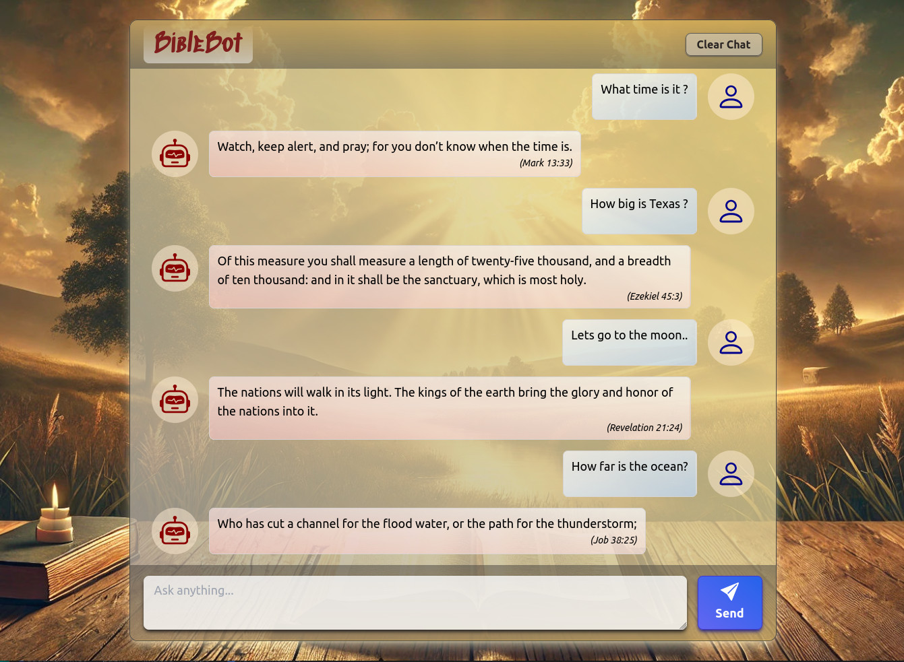

# BibleBot

A Retrieval Only Chatbot (ROC) that responds with verses from the bible.  
It is basically a RAG app without the generation part.  
The app runs entirely in the browser (without the need for a backend).  

The app is build using:

- reactJs
- tensorflow.js
- universal-sentence-encoder 
- vite
- tailwindcss
- parquetjs
- hyparquet
- react-icons
- react-spinners

# Demo

Try out the app at https://biblebot.audaxland.net/

# Usage

To install:

- Pull the repository from GitHub
```bash
git clone https://github.com/audaxland/biblebot.git
```

- Install packages:
```bash
cd biblebot
npm install
```

- Build the data file (which contains the vectors):
   (this operation can take a while )
```bash
npm run data
```

- Run the app in dev mode
```bash
npm run dev
```

- Check the dev app via your browser at http://localhost:5173/

- Run for prod mode
```bash
npm run build
npm run preview
```

- Check the prod app via your browser at http://localhost:4173/

# Screenshot

